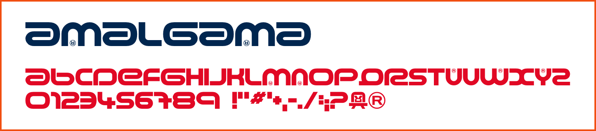
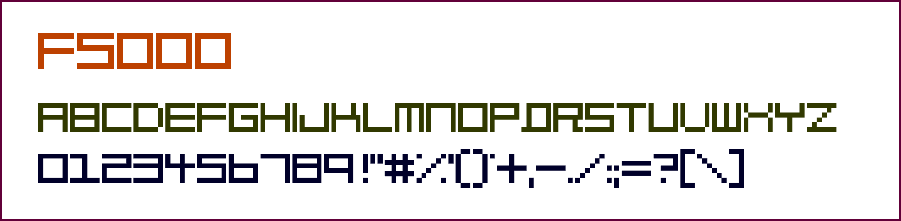
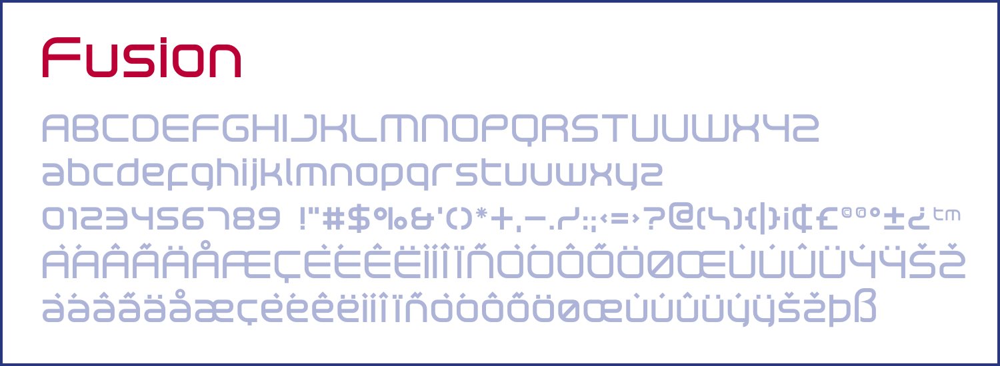
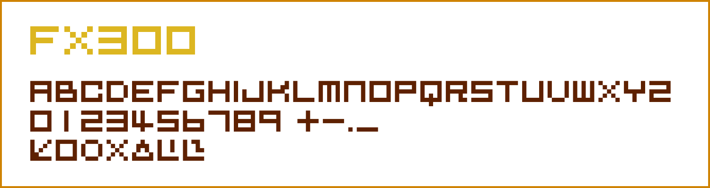
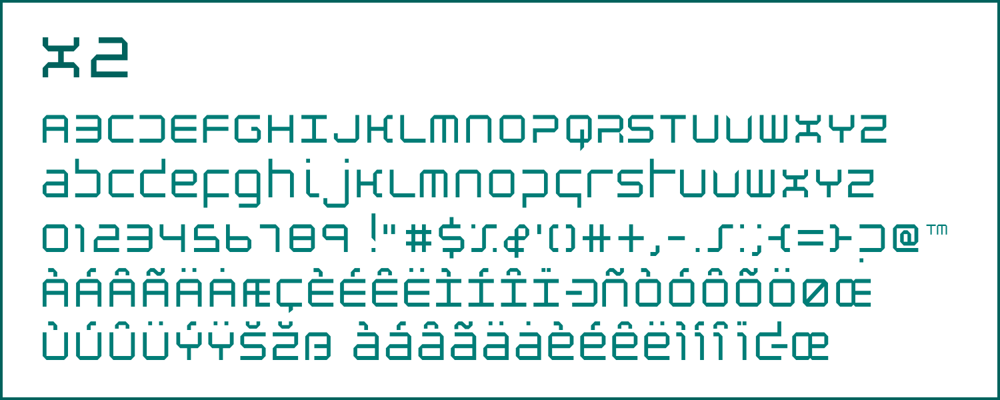
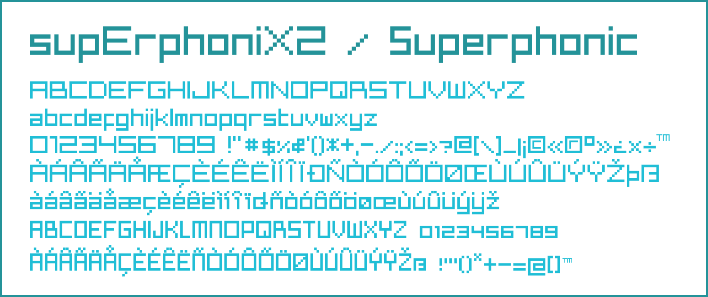
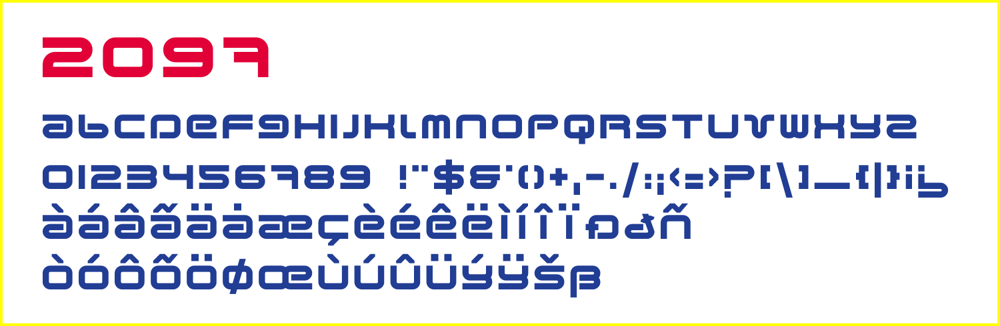
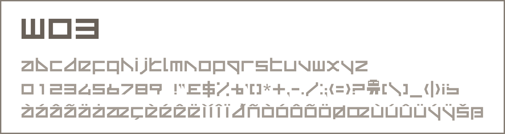

# WipEout Fonts
Fonts from the WipEout series, remade in OpenType format.

## WipEout 1 - 2097 / 64

## Wip3out

## WipEout Fusion

## WipEout Pure

## WipEout Pulse

## WipEout HD

### List of third-party fonts used in the series:

- **04b_19** (WipEout Fusion (Cover))  
- **Arial** (WipEout HD)  
- **Bitsumishi Pro** (WipEout 2048)  
- **DF So Gei W 9** (WipEout Pure / WipEout HD)  
- **Helvetica** (Wip3out / WipEout HD)  
- **Impact** (WipEout Fusion (Manual))  
- **Neo Sans** (WipEout 2048)  
- **OCR A** (WipEout Pure)  
- **OCR B** (WipEout (Cover))  
- **Orbit-B** (WipEout (Cover))  
- **TRACEROUTE** (WipEout HD)
